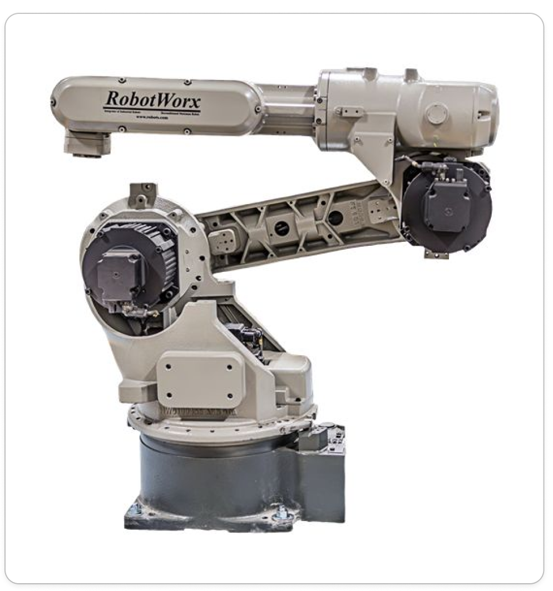
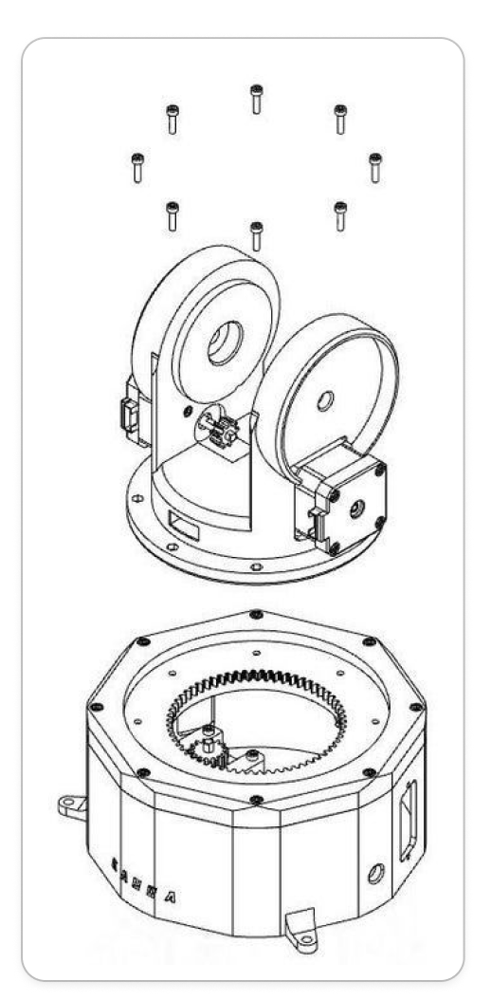
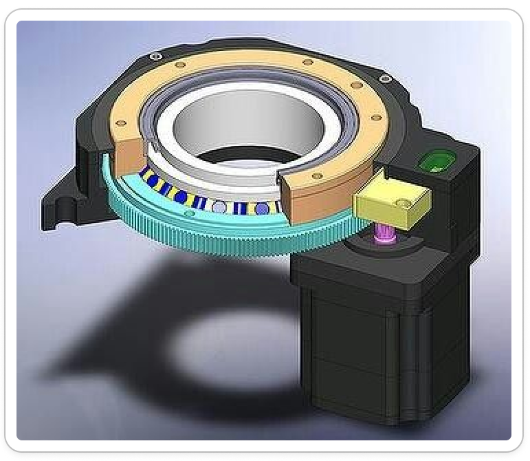

# opkomende_tech_robotarm
# intro
Voor het vak opkomende technologieën was aan ons de vrije keuze gegeven om een project te maken met daarin een microcontroller verwerkt.
Om een kleine fantasie van ons allebei te vervullen, werd gekozen om een robotische arm te maken, meer bepaald een 5-assige arm en de daarbijhorende besturingsmechanismen.

# CAD desing
Voor deze opdracht wilden we onze eigen arm ontwerpen. deze nam inspiratie op van in de industrie, zoals de vele sci-fi-films die we gezien hadden.
een paar voorbeelden van inspiratiebronnen: 

|  |  |
|--------|-----------|
||

De 3D-modellen werden uitgetekend in Siemens NX en zijn in bijlage beschikbaar in .prt-formaat, .obj-formaat en .stl-formaat.
de robotarm bestaat uit 5 motoren:
* 3 servomotoren (aangeduid in het rood)
    * 1 in de klauw 
    * 1 in het bovenste scharnierpunt
    * 1 in het onderste scharnierpunt
* 2 steppermotoren (aangeduid in het blauw)
    * 1 voor de rotatie van de klauw
    * 1 voor de rotatie van de arm 

  

  

# Electronica / Code
In het begin van het project was het de bedoeling om gebruik te maken van een Arduino Uno en een CNC-shield en daarop de nodige stepperdrivers, dit omdat het shield het makkelijk maakte om meerdere steppermotoren te controleren.Voor het besturen van de 3 servomotoren werd een PCA9685 gebruikt Deze wordt bestuurd met I2C. Bij het samenvoegen van het CNC-schield en de PCA werd al snel duidelijk dat I2C-communicatie niet mogelijk was, doordat het CNC-schield alle pinnen van de Arduino in beslag nam. okk werd er overwogen om als uitbreiding op dit project een draadloze controller te maken. Hiervoor is een Arduino Uno niet de beste keuze. Hierdoor werd er overgestapt naar een ESP32 met ingebouwde wifi- en bluetoothmodules.
het CNC-schild is helaas niet compatibel met een ESP, dus zijn de schakelingen voor de stepperdrivers handmatig gemaakt.

Het elektrisch schema is hier te vinden: 
[schema conponenten](/opkomente_tech_robotarm/elektrisch%20schema)

De drie servomotoren zorgen voor nauwkeurige positieregeling van de verschillende gewrichten van de arm. De servomotoren worden aangestuurd via de PCA9685 PWM-uitbreidingskaart, een 16-kanaals PWM-controller die via I²C-communicatie met de ESP32 communiceert, wat betekent dat slechts twee pinnen (SDA en SCL) nodig zijn voor communicatie met het PWM-uitbreidingskaart. Dit stelt de microcontroller in staat om meerdere servomotoren tegelijk aan te sturen met nauwkeurige pulsbreedte-modulatie (PWM). De PCA9685 ondersteunt frequenties van 24 Hz tot 1526 Hz, wat ideaal is voor servobedrijving. 
De twee stapelmotoren worden aangestuurd door twee A4988 stuurcircuits. De A4988 is een geïntegreerde stuurdriver speciaal ontworpen voor bipolaire stapelmotoren. Dit circuit verzorgt de complexe energietoevoer naar de motorwikkelingen en maakt microstepping mogelijk. Dit betekent dat de motor niet alleen in volle stappen kan bewegen, maar ook in kleinere stappen (bijvoorbeeld 1/16 stap), wat resulteert in vloeiere bewegingen en betere positiecontrole. Elk A4988-circuit wordt rechtstreeks door de ESP aangestuurd via standaard digitale GPIO-pinnen. 

In het begin van het project werden eerst alle outputs gevalideer.
Dit werd voor de steppers en servo's apart gedaan met volgende code:
* [stepper validatie](./opkomente_tech_robotarm/code/Steppermotor_test)
De code gebruikt de AccelStepper-bibliotheek, een krachtige bibliotheek voor stapelmotorbesturing die versnelling en deceleratie ondersteunt. Twee AccelStepper-objecten worden aangemaakt in DRIVER-modus:
stepper_BASE: Gekoppeld aan GPIO 2 (stap) en GPIO 5 (richting)
stepper_WRIST: Gekoppeld aan GPIO 7 (stap) en GPIO 8 (richting)
Twee potentiometers (GPIO 33 en 39) leveren analoge ingangen voor respectievelijk basis- en polsbesturing. De ESP32 ADC wordt ingesteld op 12-bits resolutie voor nauwkeurige waarden (0-4095).
smoothRead() neemt 16 opeenvolgende metingen van de potentiometer en berekent het gemiddelde. Dit filtert elektronische ruis eruit en resulteert in stabielere, minder trillerige sensorwaarden.
Voor beide stapelmotoren worden identieke instellingen gebruikt:
Maximale snelheid: 600 stappen/seconde
Versnelling: 300 stappen/seconde²
Deze waarden zorgen voor soepele acceleratie en deceleratie, wat trillering en mechanische schokken minimaliseert.
STEPPER_DRAAIING() werkt als volgt:
-Leest de gefilterde potentiometerwaarde
-Converteert deze naar een doelposition (0-200 stappen via map())
-Controleert of verschil tussen huidige en doelposition groter is dan 2 stappen (dode zone, voorkwamt constant oscilleren)
-Roept stepper.run() aan, die de motor stap voor stap naar het doel beweegt met ingebouwde versnelling
Beide stapelmotoren worden continu aangestuurd in een lus zonder vertraging, wat garanteert dat de motoren altijd kunnen reageren op potentiometerveranderingen met soepele, versnelde bewegingen.
* [servo validatie](./opkomente_tech_robotarm/code/robotarm_servo_test)
De code gebruikt de Adafruit_PWMServoDriver-bibliotheek om de PCA9685 PWM-controller aan te sturen via I²C (GPIO 21 en 22). De PCA9685 werkt op 50 Hz, wat standaard is voor servomotoren.
Voor elk gewricht zijn minimale en maximale pulsbreedte-waarden ingesteld (in microseconden):
Schouder: 150-600 µs (~40°-140°)
Elleboog: 200-500 µs
Gripper: 150-600 µs
Deze waarden begrenzen de bewegingsruimte en voorkomen dat servomotoren beschadigd raken.
Potentiometerlezing
Drie potentiometers (op GPIO 34, 35 en 32) leveren analoge waarden (0-4095) die overeenkomen met gewenste servoposities. Deze waarden worden gemapped naar de respectievelijke pulsbreedte-bereiken.
Hoofdfunctie is SERVO_DRAAIING(). Deze functie: leest de potentiometerwaarde,converteert deze naar een passende pulsbreedte,begreinst de waarde binnen min/max-grenzen,stuurt de pulsbreedte naar het PCA9685-kanaal. In de loop() worden alle drie servomotoren continu aangestuurd (elke 20 ms). Dit zorgt voor vloeiende real-time besturing  op basis van potentiometerbewegingen.

De inputs, in dit geval de potentiometers, konden getest worden met een multimeter en in de Arduino IDE-terminal.

# eindresultaat
Alle nodige CAD onderdellen werden uitgeprint op een elegoo neptune 3 max. 
De aluminium profiellen werden op lengte gezaagd.
en alles werd in/op elkaar geschroegt/geklikt.

  

  

  

  
alle nodige materiaal is terug te vinden in de Bill Of Materials: 

[BOM](BOM)

de finalle code werd ook geschreven en is hier te lezen:
[eind code](./code/robotarm_def_code_potmeter/robotarm_def_code_potmeter.ino)

Deze code bestuurt alle vijf motoren van de robotarm: drie servomotoren (schouder, elleboog, gripper) en twee stapelmotoren (basis en pols). Alle motoren worden real-time aangestuurd via vijf potentiometers.

De code gebruikt drie hoofd-bibliotheeken:

Adafruit_PWMServoDriver: Bestuurt de PCA9685 PWM-controller voor de servomotoren
AccelStepper: Bibliotheek voor soepele stapelmotorbesturing met versnelling

De ESP32 communiceert via I²C (GPIO 21 en 22) met de PCA9685, die op 50 Hz werkt.
Servomotoren
De drie servomotoren hebben ingestelde pulsbreedte-bereiken (150-600 µs) die hun bewegingsruimte begrenzen. Zij worden aangestuurd via kanalen 0, 1 en 2 van de PCA9685.

Twee AccelStepper-objecten worden geïnitialiseerd voor de basis- en polsrotatie met:
Maximale snelheid: 600 stappen/seconde
Versnelling: 300 stappen/seconde²
Dit zorgt voor vloeiende, versnelde bewegingen zonder plotselinge schokken.

De smoothRead()-functie neemt 16 metingen en berekent het gemiddelde. Dit elimineert elektronische ruis en zorgt voor stabielere sensorwaarden.

SERVO_DRAAIING() leest de potentiometer, converteert naar pulsbreedte en stuurt deze naar de PCA9685. De beweging volgt rechtstreeks de potentiometerstand.
Stepperbediening

STEPPER_DRAAIING() werkt anders:
- Leest de potentiometerwaarde en zet deze om naar een doelposition (0-200 stappen)
- Controleert of de huidige positie meer dan 2 stappen van het doel verschilt (dode zone)
- Roept stepper.run() aan voor vloeiende versnelde beweging naar het doel. Dit zorgt voor minder verschijnijving dan directe servobediening.

Door de Loop functie worden alle vijf motoren elke 20 ms aangestuurd, wat zorgt voor responsieve real-time besturing van de complete robotarm.