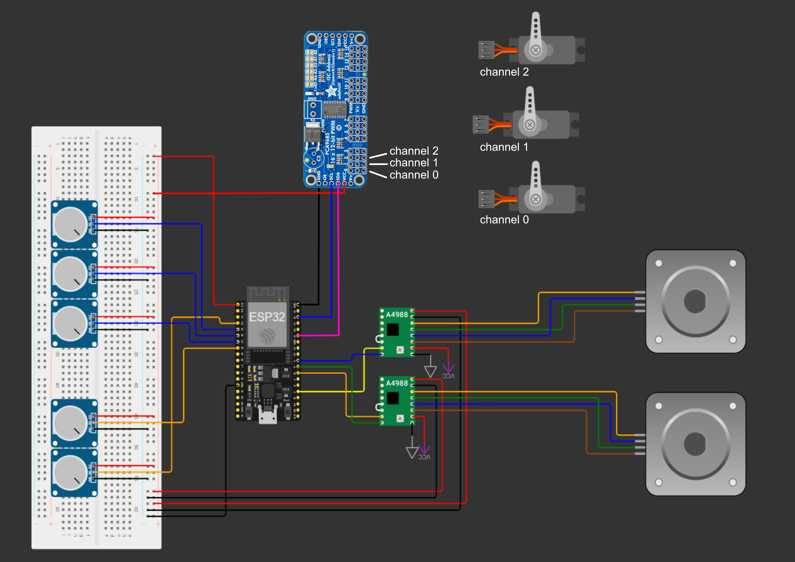

# Robot Arm — Elektrisch Schema

Het volgende schema geeft weer hoe alle componenten aan elkaar verbonden zijn.

  

 
---

## Verbindingen

### Potentiometers → ESP32

Alle potentiometers zijn via het breadboard verbonden met GND en 3.3V van de ESP32.

| Naam | Gewricht | Pin |
|---|---|---|
| Pot 1 (blauw) | Shoulder | P34 |
| Pot 2 (blauw) | Elbow | P35 |
| Pot 3 (blauw) | Gripper | P32 |
| Pot 4 (wit) | Base | P33 |
| Pot 5 (wit) | Wrist | P39 |

---

### Stappenmotoren → ESP32 (via A4988)

Reset en sleep zijn kortgesloten op beide drivers. GND en VDD lopen via het breadboard naar de ESP32, VMOT en de bijhorende ground naar een externe 12V-bron.

| Motor | Step | Dir |
|---|---|---|
| Stepper 1 | P2 | P5 |
| Stepper 2 | P16 | P17 |

---

### Servo's → PCA9685

De PCA9685 is verbonden met de ESP32 (SCL → P21, SDA → P22). VCC en GND lopen via het breadboard.

| Servo | Gewricht | Kanaal |
|---|---|---|
| Servo 1 | Shoulder | 0 |
| Servo 2 | Elbow | 1 |
| Servo 3 | Gripper | 2 |

---

